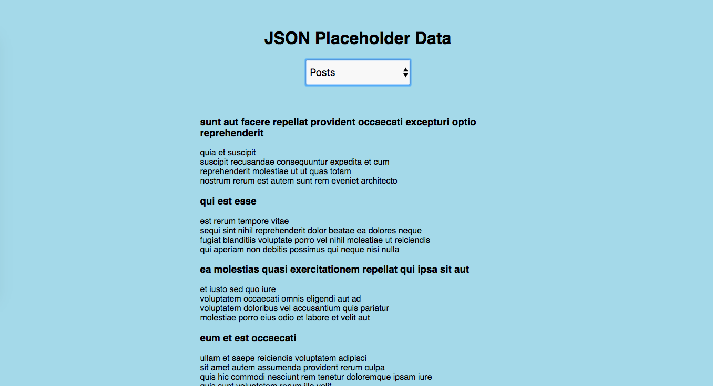

# Practice Exam

## Back to the JSON Placeholder

Create an app that renders every base route of the JSON Placeholder API. Your app should query the following routes:

- https://jsonplaceholder.typicode.com/posts
- https://jsonplaceholder.typicode.com/comments
- https://jsonplaceholder.typicode.com/albums
- https://jsonplaceholder.typicode.com/photos
- https://jsonplaceholder.typicode.com/users
- https://jsonplaceholder.typicode.com/todos

Create a page with three items:

- An `h1` tag containing the words "JSON Placeholder Data"
- A `select` box containing each option ("Posts", "Comments", "Albums", "Photos", "Users", "Todos"), with the class `data-type`
- An empty `div` with the class `data`

Each time your user changes their selection in the `select` box, query the corresponding route using the JSON Placeholder API. Your page should update with **two** pieces of information from **each element** of data.

For example, `posts` each have a title and a body - when the user selects "Posts", display each post's title and body. For each item, the first piece of information should be in an `h3` tag, and the second should be in a `p` tag. Assemble each of these `h3`s and `p`s inside a new `div`, also with the class `data`. Replace your old `data` div with this new one. In other words, you're replacing your old `data` div with a `div` with the same class, but with data inside it instead of empty.

## Styling

On top of default HTML styling, the app should have the following styles:

- **Entire App**

  - Fonts should be sans-serif.
  - The background color should be `lightblue`.
  - Everything should be in a column, justified center.

- **h1**

  - Include 30px of padding or margin on top.

- **select**

  - Should be 200px wide and 50px tall.
  - Font size should be 20px.
  - Bottom margin should be 40px.

- **data**
  - Should have a width of 600px.

It should end up looking something like this:

